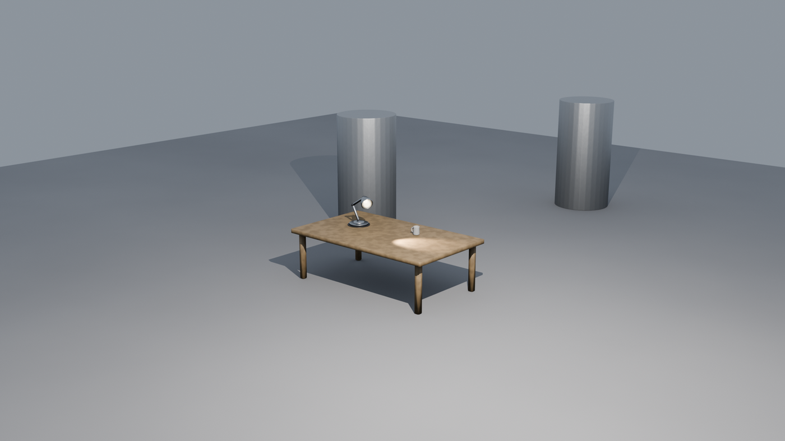
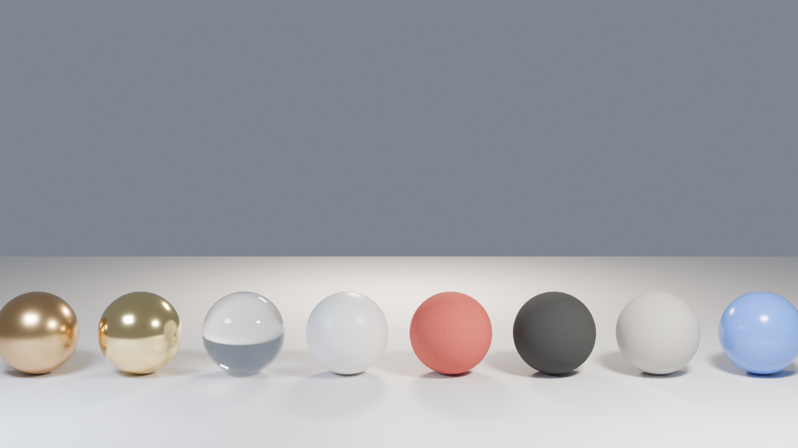
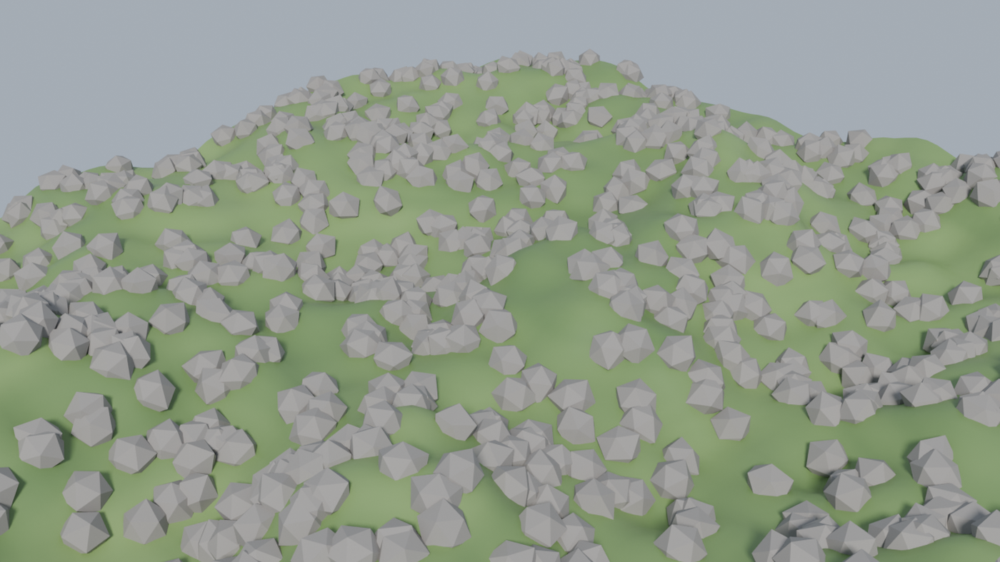
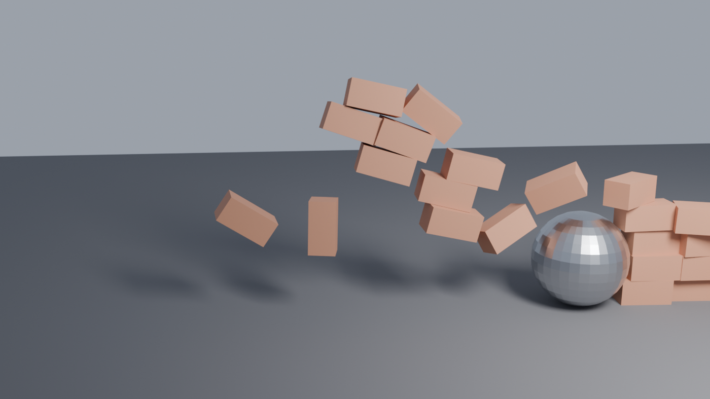

# blender-mcp-ultra

[](https://github.com/carlosh7/blender-mcp/actions/workflows/ci.yml)
[](https://github.com/carlosh7/blender-mcp/releases)
[](LICENSE)
[](pyproject.toml)
[](https://www.blender.org)
[](ACTION_PLAN.md)

**The most complete MCP server for Blender** — control Blender with natural language from any AI agent: Claude Code, Claude Desktop, Cursor, opencode, Windsurf, Antigravity, LM Studio, Ollama and any Model Context Protocol (MCP) client.

> **239 tools** · Windows / macOS / Linux · headless-ready · production-grade security



*Scene above: 100% created and rendered by an AI agent through this MCP server — no manual modeling.*

## Gallery — what agents build with it

| PBR materials | Geometry Nodes | Physics |
|---|---|---|
|  |  |  |
| `material_pbr` + 3-point lighting | `geonodes` scatter + noise terrain | rigid body + baked simulation |

Every image above was generated end-to-end through MCP tools — scene setup, materials, lighting, camera framing, simulation and final Cycles render.

---

## What is it?

`blender-mcp-ultra` connects **Blender** (the free open-source 3D suite) to **LLM agents** through the **Model Context Protocol**. Ask your AI assistant to model, texture, light, animate, simulate and render 3D scenes — it executes through 245 typed tools instead of fragile screenshot-guessing.

```text
You:     "Create a wooden table with a coffee mug on it and render it in Cycles"
Claude:  → object.create, mesh ops, material PBR wood, light.three_point,
          camera.set_framing, render.render → escena.png
```

## Highlights

- 🧰 **245 MCP tools** (6 base + 239 registry) — modeling, materials, shader nodes, geometry nodes, lighting, cameras, animation, physics, compositor, UV, rigging, 3D printing, export (FBX/OBJ/glTF/STL), batch, VLM visual feedback, multi-agent collab, scene planner
- 🖥️ **Any MCP client** — stdio (Claude Code/Desktop, Cursor, opencode, VS Code, Windsurf), SSE/HTTP (Antigravity, remote), REST
- 🧠 **VLM feedback loop** — the agent *sees* its renders (EEVEE headless capture) and iterates
- 🔒 **Enterprise security** — AST code validation (200+ blocked patterns), sandboxed execution, rate limiting, token auth, localhost-only binding, 0 secrets in history (gitleaks)
- 🤖 **Multi-provider** — OpenAI, Anthropic, Google, DeepSeek, Ollama (local)
- 📦 **Asset integrations** — PolyHaven, Sketchfab, AmbientCG, Hyper3D
- 🚀 **Headless CI** — real E2E tests against Blender in GitHub Actions (Linux + Windows + macOS)
- 🧪 **479 tests passed** · ruff · bandit · pip-audit clean

## Quick Start

### 1. Install the Blender addon

Download [`blender_mcp_ultra.zip`](https://github.com/carlosh7/blender-mcp/releases/latest) → Blender → `Edit > Preferences > Add-ons > Install…` → enable **blender-mcp-ultra** → click **Connect** in the N-panel.

Or install from this repo (Blender 4.2+/5.x):

```bash
git clone https://github.com/carlosh7/blender-mcp.git
cd blender-mcp
pip install -e .
```

### 2. Connect your AI client

Install the gateway (provides the `blender-mcp-server` command). Startup order doesn't matter: all tools register even if Blender is closed and work as soon as you open it.

```bash
pip install blender-mcp-ultra
```

<details open>
<summary><b>Claude Code</b></summary>

```bash
claude mcp add blender -- blender-mcp-server
# o, desde un checkout del repo:
claude mcp add blender -- python /ruta/a/blender-mcp/mcp_server.py
```

More: [docs/clients/claude-code.md](docs/clients/claude-code.md)
</details>

<details>
<summary><b>Claude Desktop / Cursor / Windsurf / VS Code</b> (mcp.json)</summary>

```json
{
  "mcpServers": {
    "blender": {
      "command": "blender-mcp-server"
    }
  }
}
```

More: [docs/clients/claude-desktop.md](docs/clients/claude-desktop.md) · [cursor.md](docs/clients/cursor.md) · [vscode.md](docs/clients/vscode.md)
</details>

<details>
<summary><b>opencode</b></summary>

```bash
python mcp_server.py            # el addon auto-escribe ~/.config/opencode/mcp.json
```

More: [docs/clients/opencode.md](docs/clients/opencode.md)
</details>

<details>
<summary><b>Antigravity / clientes HTTP / remoto</b></summary>

```bash
python mcp_server.py --sse      # SSE en :9879 (MCP_SSE_HOST para exponer)
# REST local: http://localhost:9877 (token en preferencias del addon)
# Docker:
docker build -t blender-mcp-gateway . && docker run -p 9879:9879 blender-mcp-gateway
```

More: [docs/clients/antigravity.md](docs/clients/antigravity.md) · [docs/remote.md](docs/remote.md)
</details>

### 3. Ask your agent

```
"Modela una silla de madera con biselado y material PBR, ilumina en 3 puntos y renderiza"
```

## Tools (245)

| Category | Examples |
|---|---|
| **Scene** | `scene.get_info`, `scene.create`, `scene.render_settings`, `scene.query` |
| **Objects & Mesh** | `object.create/transform/join`, `mesh.get_topology`, `mesh.bevel_edges`, `mesh.extrude_faces` |
| **Materials & PBR** | `material_create`, `material_pbr` (wood/metal/fabric/leather/stone/glass…), `material_assign` |
| **Shader / Geo Nodes** | `shader.add_node/connect_nodes`, `geonodes.scatter/array/create_group` |
| **Lights & Camera** | `light.three_point`, `light_create`, `camera.track_to`, `camera.set_framing` |
| **Animation** | `animation.set_keyframe`, `animation_get_fcurves`, NLA, drivers, shape keys |
| **Physics** | rigid body, cloth, soft body, particles, force fields, constraints, baking |
| **Render** | Cycles/EEVEE settings, `render_render`, `render_viewport`, filmic, jobs con progreso |
| **I/O & Export** | FBX, OBJ, glTF, STL + `export_for_target` (game/web/print/film), LODs, colisiones |
| **UV & Texture** | smart UV project, unwrap, bake, textures |
| **Rigging** | armatures, bones, constraints, vertex groups, auto weights |
| **3D Printing** | manifold/watertight checks, scale to mm, dimensions |
| **Batch & Perf** | batch rename/materials/modifiers, turntable, LODs, memory report |
| **VLM Feedback** | `vlm_capture`, `vlm_analyze`, composition & lighting checks |
| **Collab & Planner** | locks por objeto, mensajes entre agentes, tareas, `plan_create/execute` |
| **Versioning & Docs** | `vc_snapshot/restore`, `docs_scene`, eventos `poll_events` |

Full reference generated from the live registry: `docs_scene` tool · skills/recetas en [`docs/skills/`](docs/skills/README.md).

## Security

| Layer | Mechanism |
|---|---|
| Transport | localhost-only sockets + `X-API-Token` auth (HTTP) |
| Code execution | AST validation (200+ blocked patterns) + sandboxed subprocess (CPU/RAM limits, timeout) |
| Input | path traversal / injection validation |
| Audit | structured JSON logs with rotation |
| Supply chain | gitleaks (full history) + pip-audit in CI |

## Architecture

```
AI Agent (Claude/Cursor/…) ──MCP stdio/SSE──▶ mcp_server.py (gateway, 245 tools)
                                                  │ socket :9876 (localhost + token)
                                                  ▼
                                    Blender + addon blender-mcp-ultra
                                    (handlers, validators, PBR, physics…)
```

```
mcp_ultra/  # hexagonal: core / adapters / infrastructure / presentation / tools
addon/      # Blender addon: socket server, handlers, PBR factory, anti-blockout
skills/     # 19+ skill definitions for Claude Code / Cursor
docs/       # client guides, skills recipes, tutorials
tests/      # 479 tests (unit + integration + e2e headless)
```

## Testing

```bash
pytest tests/unit -q          # sin Blender
pytest -q                     # completo (requiere Blender con el addon conectado)
```

CI ejecuta la suite completa contra Blender headless en cada push (Linux, Windows, macOS).

## FAQ

**Does it work with ChatGPT / Gemini?** Any client that speaks MCP works. For providers without MCP support, the bundled REST API (`:9877`) accepts plain HTTP.

**Does Blender need to be open?** Yes for interactive work (it drives the real Blender). CI/headless render jobs run with `blender -b` — see [docs/skills/headless_ci.md](docs/skills/headless_ci.md).

**Is it safe?** The agent can execute Blender Python — that's the product. Execution is sandboxed, validated by AST, rate-limited and bound to localhost with token auth. Run trusted agents only.

**Blender versions?** 4.2+ (LTS) and 5.x. Python 3.10+ for the gateway.

## Contributing

PRs welcome — read [CONTRIBUTING.md](CONTRIBUTING.md). Docs: [GUIDE.md](GUIDE.md) · [ARCHITECTURE.md](ARCHITECTURE.md) · [CHANGELOG.md](CHANGELOG.md)

## License

MIT — see [LICENSE](LICENSE).
